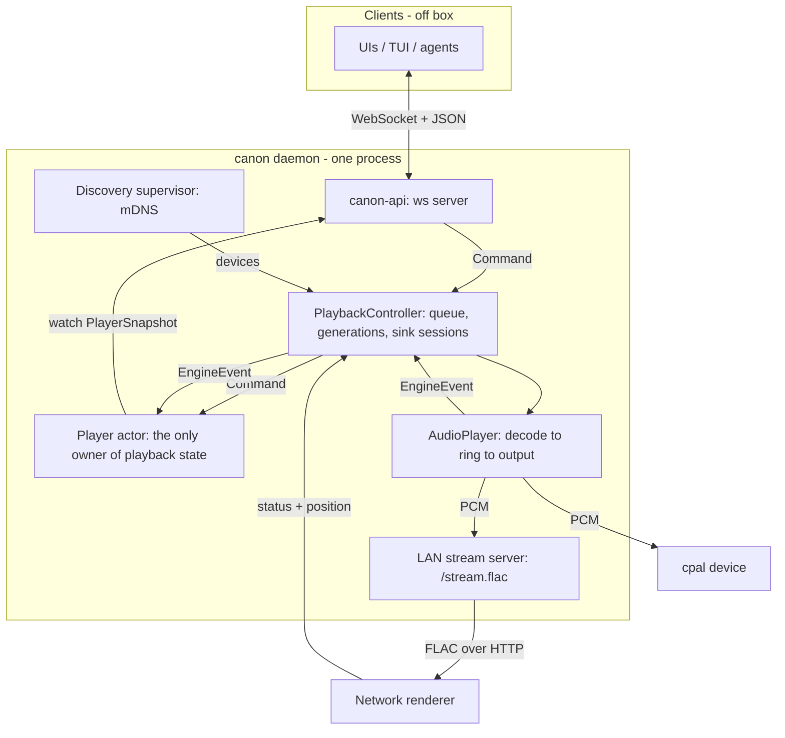
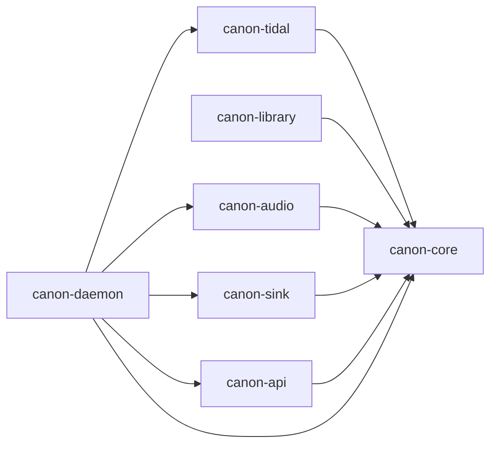

# canon — architecture

A single self-contained Rust binary: a headless music daemon that owns the library and
metadata, talks to music services (Tidal first), plays to local audio *and* LAN
renderers, and exposes a control plane so remote UIs, TUIs, and agents can drive it.

`AGENTS.md` holds the working agreements (green bar, yaks discipline, the on-metal
harness, pitfalls). **This** document holds the shape of the system: what the pieces
are, which way they depend, and which invariants are load-bearing.

---

## 1. The constraint that decided everything

> canon must run headless on a Linux box with **no local audio device at all**, playing
> only to network renderers.

That single requirement is upstream of most of the design:

- A network renderer can't be a bolt-on "cast this out" feature layered over a local
  device. It is a first-class output, equal to cpal.
- "Keep the local device open but muted and mirror to the network" is not available, so
  there is exactly **one active output** and switching restarts the stream at the current
  position.
- The local frame counter can't be the universal clock, because on that box it doesn't
  exist. Position needs one authority *per output* (§6).

The second shaping force is the predecessor, **tideway** (Python, at
`/Users/joel/src/tideway`). It worked, but was flaky in ways that traced back to
architecture rather than bugs-in-the-small. Several sections below exist specifically to
make a tideway failure mode unrepresentable; those are marked **(tideway tax)**.

---

## 2. Runtime shape

One process. Inside it, a small number of long-lived tasks around a single state-owning
actor.



Two rules make that picture trustworthy:

1. **Every input that can change playback reality is a message into the player actor.**
   User intent arrives as a `Command`; reality (decoder opened, track ended, device said
   it paused, sink died) arrives as an `EngineEvent`. Nothing mutates state on a side
   thread. **(tideway tax:** its emitted "now playing" could silently desync from what
   was actually happening, because position and liveness lived in the audio callback
   while transport state lived elsewhere.**)**
2. **Clients never hold playback logic.** They send commands and render snapshots. The
   queue lives on the server, not in a client.

---

## 3. Crate map

Everything depends **inward** on `canon-core`, which depends on nothing of ours.

| crate | what lives there | status |
| --- | --- | --- |
| `canon-core` | Entities/ids, playback state + `FrameClock`, position authorities, `Command`/`EngineEvent`, the player actor, the `Source`/`Sink`/`PcmSink` seams, `ControlPlane`. | built |
| `canon-tidal` | PKCE + device-code auth, rotating-refresh token lifecycle, stream resolution (DASH/MPD → fMP4 segments), segment reader as a seekable `MediaInput`. | built |
| `canon-audio` | Symphonia decode, lock-free ring + realtime-safe callback, cpal local output, network feed loop, resampling. | built |
| `canon-sink` | mDNS discovery supervisor, LAN FLAC stream server, PCM→FLAC encoder tap, `connect` + `EdgeFilter`, the Chromecast `Sink`. DLNA lands here as a second protocol module. | built (DLNA pending) |
| `canon-api` | axum WebSocket + JSON control plane; the wire schema. MCP tools land here. | built (MCP pending) |
| `canon-library` | Canonical entity model, MBID identity, source bindings, local file index, import/export. | **stub only** — doc comment + plan |
| `canon-daemon` | The `canon` binary and the `PlaybackController` that glues source → engine → player. | built |



`canon-daemon` is the only crate that knows about all of them; it is where composition
happens and where policy (queue, auto-advance, fail-back) lives.

---

## 4. The seams

Four types carry essentially the whole contract.

**`Source` (bytes + metadata in).** A service implements it; `canon-tidal` is the only
implementation today. It resolves a `SourceRef` to a `TrackRef` plus a seekable
`MediaInput`. The daemon holds `Arc<dyn Source>`, so adding Spotify or a local-file
source is additive.

**`Sink` / `RendererEvent` / `PcmSink` (audio out).** Which output is active is *state*, not
a mode flag. `PcmSink` is the data plane both paths share: the engine pushes PCM to it, and the
network one is the FLAC tap. `Sink` is the control plane of a **network** renderer: `load(url)`,
play/pause/stop, and volume/mute. Its commands are fire-and-forget. What the device then does
comes back on its `RendererEvent` stream (`State`, `Position`, `Ended`, `Superseded`, `Failed`),
never assumed from having sent the command. A protocol module only classifies its own wire into
those events. `canon_sink::connect` is the one place that knows which protocols exist, and
`EdgeFilter` is the one conditions-vs-edges rule (§7). The controller holds a `Box<dyn Sink>` and
never names a protocol. Local is not a `Sink`: it is the resting route, active when no renderer
is selected. `OutputRoute`/`LocalGate`/`RouteGuard` make un-silencing RAII-bound so a teardown
path can't leak a muted device. They are built and reserved for multi-room (`canon-0205`).

**`Command` (user intent).** The single vocabulary. WebSocket ops and (later) MCP tools
both funnel into it. Nothing else may mutate playback.

**`EngineEvent` (reality changed).** `Loaded`, `Ended`, `Failed`, `RendererState`,
`RendererPosition`, `SinkFailed`. This is the *only* way the world tells the player
something happened.

> **The `Command`/`EngineEvent` split is load-bearing.** A device's status must never
> enter as a `Command`. If "the speaker reports it is playing" is laundered into
> `Command::Play`, the player permanently loses the ability to distinguish *the device is
> playing* from *the user pressed play* — and then a device-initiated pause and a user
> pause are the same event. Because a renderer's end-of-track arrives the same way a
> local one does, queue auto-advance is literally the same code on both paths.

---

## 5. Playback data flow

### Local path

```
Tidal segments ──▶ MediaInput ──▶ Symphonia decode ──▶ SPSC ring ──▶ cpal callback ──▶ device
                                                                      │
                                                                      └─▶ FrameClock (frames emitted)
```

The realtime callback is allocation-, lock-, and syscall-free. It owns **no**
clock-of-record; it only advances a `FrameClock` and stamps the device epoch. A control
task derives position from `frames / sample_rate` on a 250 ms tick (`POSITION_TICK`) and
publishes a seq-stamped snapshot. A stalled callback is therefore *visible* — frames stop
advancing — rather than an invisibly frozen emitter.

### Network path

```
… decode ──▶ PcmSink ──▶ FlacTap (PCM→FLAC) ──▶ StreamBroadcaster ──▶ HTTP /stream.flac ──▶ renderer
                │                                                                             │
          paced ~2s ahead (NETWORK_LEAD)                          status + position ──────────┘
```

Three things about this path are easy to get wrong and are already settled:

- **Pacing.** The feed loop runs ~2 s ahead of realtime (`NETWORK_LEAD` in
  `canon-audio::engine`) so the renderer's buffer stays fed without unbounded run-ahead.
- **Full-scale PCM.** The renderer owns volume; canon does not attenuate before encoding.
- **Header replay.** `StreamBroadcaster` always replays the FLAC header to a *joining*
  consumer, so a renderer that reconnects mid-stream gets a decodable stream rather than
  garbage.

---

## 6. Position has one authority per output

`canon-core/src/position.rs`. This is the section to read before touching anything
time-related. **(tideway tax:** it pulled stream position from whatever was nearest to
hand and paid for it forever.**)**

| output | authority | why |
| --- | --- | --- |
| local | `FrameClock` — frames the RT callback actually emitted | we drive the device sample by sample, so frames *are* position |
| network | the renderer's own reports (`RendererClock`), extrapolated by wall time between them | the device plays on its own clock and buffers ahead of us |

`PositionDrive::{Frames, Renderer}` is settled once per stream open — which is also once
per output, because switching outputs restarts the stream. There is no way to end up
mid-stream with the wrong drive.

On the network path, **frames fed to the encoder are not position.** They lead what the
listener hears by the buffer depth (measured at ~3.8 s here). Worse, deriving position
from them is open-loop: nothing ever corrects it.

**Renderer reports are relative to the stream the device was handed.** After a seek, that
stream *starts at the seek point*, so a report of `00:00:05` may mean 1:35 on the
timeline. `RendererClock` carries an `origin` for exactly this; read reports against it.

Reports arrive ~2/sec, far too rarely to display raw, so `reconcile()` folds each one in:

- Disagreement > `SNAP` (1.5 s) → snap to the reported value.
- Otherwise **slew**: `drift/4` when ahead, `drift/8` when behind. Backward correction is
  gentler on purpose — that asymmetry is what a coarse-reporting renderer looks like
  (DLNA's `RelTime` is truncated to whole seconds, which reads as a permanent ~0.5 s lag).

Corrections are deliberately **not** seeks. A seek is a user-visible discontinuity that
bumps the clock epoch and that clients read as "the user jumped"; a routine correction is
just us sharpening an estimate. Applying reports verbatim twice a second would make every
progress bar twitch.

---

## 7. State rules that are load-bearing

These were each paid for. Don't re-litigate without new evidence.

**Conditions vs edges.** `Playing` / `Paused` / `Buffering` are *conditions* and must keep
flowing from the device. Only one-shot *edges* — `Ended`, `Superseded`, `Failed` — are
deduped, because each drives a one-shot action. Suppressing repeated conditions upstream
is how the player ends up believing something the device is not doing; it once wedged
playback in `Loading`. Corollary: **whether a report is a transition is the player's
call**, because only the player knows its own state. `Actor::handle()` returns
`Transition::{Yes, No}` for precisely that reason.

**`seq` marks transitions only.** Clients read a new `seq` as "something happened".
Position refreshes and routine reconciliation re-emit under the *same* `seq`, so a client
can interpolate with the snapshot's `rate` between transitions without a high-frequency
server poll.

**Liveness is "are our bytes being consumed."** `StreamBroadcaster::consumers()` is the
health signal, not the control channel. It is protocol-agnostic and catches takeovers the
control channel never mentions — e.g. Spotify Connect grabbing the speaker, which is
invisible over Cast. When consumers drop to zero under an active network sink, the
controller fails back to local.

**Prefer the signal the OS or library already owns.** A blind TTL once reaped live devices
because it second-guessed mDNS remove events. Don't build a parallel truth next to a layer
that already has one.

**One active output.** Switching sinks restarts the track at the current position.

---

## 8. Discovery and the stream server

`canon-sink::discovery` is a supervised, self-healing mDNS service. It enumerates real LAN
interfaces and **excludes tunnels** (utun/VPN), pins multicast egress per interface, and
rebuilds sockets and rejoins groups across sleep/wake. **(tideway tax:** its discovery
died on network changes and never came back.**)**

`canon-sink::stream_server` serves `/stream.flac` over HTTP with header replay on join and
bounded per-reader backpressure, and exposes `consumers()` as the liveness signal above.

The renderer is handed a URL on the daemon's **LAN** address, not loopback — which is why
the macOS Application Firewall matters (see `AGENTS.md`; `target/debug/canon` is
allow-listed, but per-build test binaries are not).

---

## 9. Control plane

`canon-api`: one JSON object per WebSocket text frame, both directions.
`PROTOCOL_VERSION = 1`.

- **Client → server:** `{ "op": "...", ... }` plus an optional `id` the server echoes on
  the matching reply. Transport verbs (`play`, `pause`, `seek`, `select_sink`,
  `enqueue`, `next`, …) are fire-and-forget into the actor; `login_*` / `account` are
  request/response.
- **Server → client:** `hello` once; `snapshot` immediately on connect and on every
  change; `reply` correlated by `id`.

Full snapshots rather than field-level deltas — the snapshot is small and self-consistent,
and the `seq` contract leaves room to add real deltas later without a client change.

WebSocket+JSON was chosen so a hand-rolled TUI or native client can speak it with no
codegen step. **MCP tools (`canon-c67f`) will be a second face over the same `Command`
vocabulary**, not a parallel path.

### The daemon CLI

`canon serve | login tidal --pkce | play | play-file | resolve | devices | cast | control`

`canon control` is the on-metal harness: a **line-oriented** client, one command per line
on stdin, so it drives identically from a terminal or a pipe. See `AGENTS.md` for the
end-to-end one-liner. This is not a toy — five bugs so far passed every unit test and
failed instantly on a real speaker.

---

## 10. External crates, and why

| crate | for | note |
| --- | --- | --- |
| `symphonia` (isomp4, flac, aac) | decode/demux | the fMP4 spike that de-risked Tidal's container |
| `cpal` | local output | |
| `rtrb` | SPSC ring | realtime-safe, no allocation in the callback |
| `wreq` + `wreq-util` | HTTP with TLS-fingerprint impersonation | Tidal's API expects a browser-shaped client. **Stay on 0.15** — 0.16 requires rustc 1.98 |
| `mdns-sd` | discovery | |
| `socket2`, `if-addrs` | interface enumeration, multicast egress pinning | |
| `rust_cast` | Chromecast | **blocking**, with one mutex over the TLS stream held across reads → one thread owns all Cast I/O. Pulls `aws-lc-sys`/cmake; `canon-d419` tracks moving to `ring` |
| `flacenc` | PCM→FLAC | |
| `axum` | ws control plane + LAN stream server | |
| `rupnp` | DLNA/UPnP | **planned**, `canon-685a` |

---

## 11. What exists, what doesn't

**Live and hardware-verified:** Tidal PKCE → Symphonia decode → cpal local speakers, *and*
→ FLAC encode → LAN HTTP → Chromecast; driven over WebSocket, with a server-owned queue,
seek, next/prev/play/pause, sink selection, auto-advance, and external-takeover fail-back.

**Not built yet:**

- **DLNA** (`canon-685a`) — the last child of the sink epic.
- **The library** (`canon-4185` and children) — `canon-library` is a stub. This is where
  canon diverges hardest from tideway: canon owns identity and organization, and upstream
  services become interchangeable sources. MusicBrainz MBIDs are the chosen canonical
  identity, ISRC the first-class join key, sqlite the store.
- **MCP tools** (`canon-c67f`).
- **DSP chain** (`canon-caae`): ReplayGain → EQ → crossfeed → crossfade.
- **Multi-room** (`canon-0205`) — the `OutputRoute` primitives exist for it.
- **Settings/config** (`canon-f04a`) — deliberately parked; everything configurable today
  is CLI-only, and the yak's value is a *rule* that needs real fields to govern.
- **Spotify** (`canon-1175`) — feasibility investigation only.

---

## 12. Picking this up

1. Read `AGENTS.md` first — green bar, yaks discipline, the harness, the pitfalls.
2. `yaks list --all` for the herd; the two shaving epics are `canon-7718` (sinks) and
   `canon-b192` (audio). `yaks inbox` for anything waiting on a human.
3. Before touching time or position, read `canon-core/src/position.rs` top to bottom.
4. Before touching device state, re-read §4 and §7 here — the `Command`/`EngineEvent`
   split and conditions-vs-edges are the two rules most likely to be violated by a
   plausible-looking change.
5. **Anything touching a device gets verified on metal.** Unit tests are not grounds for
   shearing. Exercise *transport* — seek, pause, resume, skip — not just steady-state
   playback.
