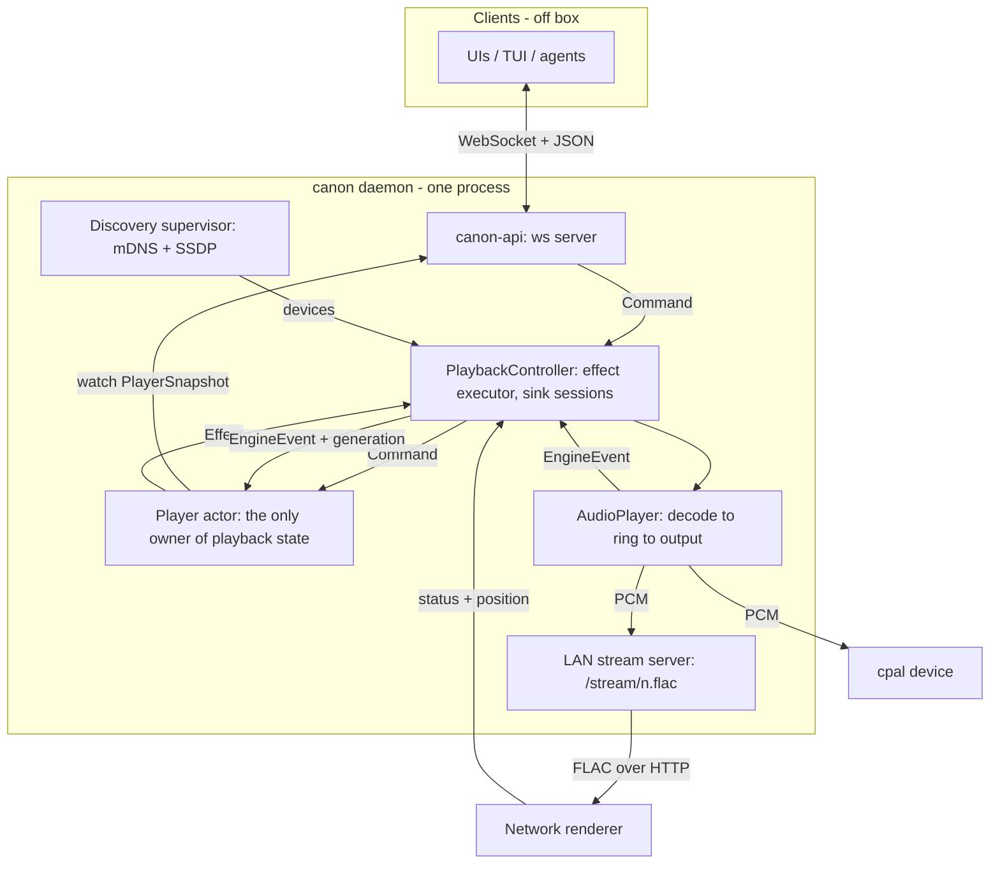
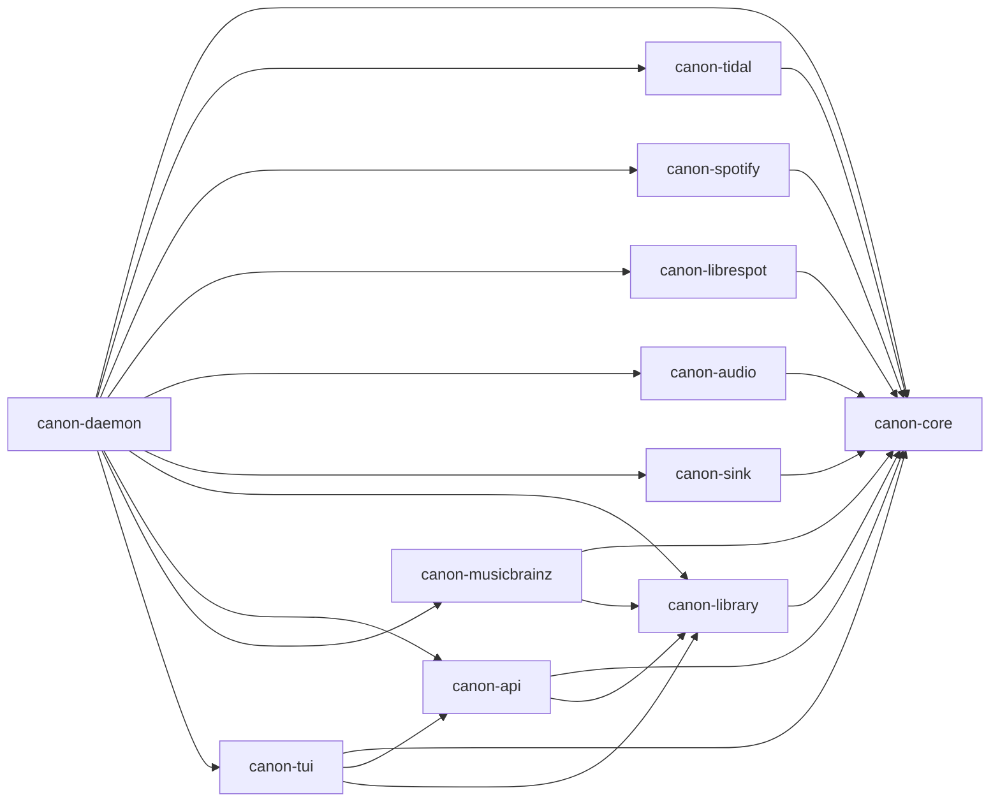

# canon — architecture

A single self-contained Rust binary: a headless music daemon that owns the library and
metadata, talks to music services (Tidal, Spotify), plays to local audio *and* LAN
renderers, and exposes a control plane so remote UIs, TUIs, and agents can drive it.

`AGENTS.md` holds the working agreements (green bar, yaks discipline, the on-metal
harness, pitfalls, the crate-by-crate map). **This** document holds the shape of the
system: what the pieces are, which way they depend, and which invariants are
load-bearing. It's a map for diving into the code, not a substitute for reading it.

---

## 1. The constraint that decided everything

> canon must run headless on a Linux box with **no local audio device at all**, playing
> only to network renderers.

That single requirement is upstream of most of the design:

- A network renderer can't be a bolt-on "cast this out" feature layered over a local
  device. It is a first-class output, equal to cpal.
- "Keep the local device open but muted and mirror to the network" is not available, so
  there is exactly **one active output**, and switching restarts the stream at the
  current position.
- The local frame counter can't be the universal clock, because on that box it doesn't
  exist. Position needs one authority *per output* (§7).

The second shaping force is the predecessor, **tideway** (Python). It worked, but was
flaky in ways that traced back to architecture rather than bugs-in-the-small. A few
decisions below exist specifically to make a tideway failure mode unrepresentable;
those are marked **(tideway tax)**.

---

## 2. Runtime shape

One process. Inside it, a small number of long-lived tasks around a single
state-owning actor.


```mermaid
flowchart TB
    subgraph clients [Clients - off box]
        UI[UIs / TUI / agents]
    end

    UI <-->|WebSocket + JSON| API

    subgraph daemon [canon daemon - one process]
        API[canon-api: ws server]
        CTRL[PlaybackController: effect executor, sink sessions]
        PLAYER[Player actor: the only owner of playback state]
        ENGINE[AudioPlayer: decode to ring to output]
        DISC[Discovery supervisor: mDNS + SSDP]
        HTTP[LAN stream server: /stream/n.flac]
    end

    API -->|Command| CTRL
    CTRL -->|Command| PLAYER
    PLAYER -->|watch PlayerSnapshot| API
    PLAYER -->|Effect| CTRL
    CTRL -->|EngineEvent + generation| PLAYER
    ENGINE -->|EngineEvent| CTRL
    CTRL --> ENGINE
    DISC -->|devices| CTRL
    ENGINE -->|PCM| HTTP

    HTTP -->|FLAC over HTTP| DEV[Network renderer]
    ENGINE -->|PCM| LOCAL[cpal device]
    DEV -->|status + position| CTRL
```

Three rules make that picture trustworthy:

1. **Every input that can change playback reality is a message into the player actor.**
   User intent arrives as a `Command`; reality (decoder opened, track ended, a device
   said it paused, a sink died) arrives as an `EngineEvent`. Nothing mutates state on a
   side thread. **(tideway tax:** its emitted "now playing" could silently desync from
   what was actually happening, because position and liveness lived in the audio
   callback while transport state lived elsewhere.**)**
2. **Decisions in the actor, effects out.** The actor owns the queue, what plays next,
   when it advances, and the playback **generation**; it does no I/O. Each decision
   goes out as an `Effect`. The controller executes it and reports engine events tagged
   with the generation they belong to; the actor drops reports about a playback it has
   already left.
3. **Clients never hold playback logic.** They send commands and render snapshots. The
   queue lives on the server, not in a client.

---

## 3. Crate map

Everything depends **inward** on `canon-core`, which depends on nothing of ours.
`canon-daemon` is the only crate that knows about all of them — composition happens
there, and so does carrying out the actor's effects (resolving a source, running the
engine, opening and tearing down network sessions). Playback *policy* (queue,
auto-advance, fail-back resume) belongs to the actor, in `canon-core`. See
`AGENTS.md`'s crate map for what lives where.


```mermaid
flowchart LR
    TIDAL[canon-tidal] --> CORE[canon-core]
    SPOTIFY[canon-spotify] --> CORE
    LIBRESPOT[canon-librespot] --> CORE
    AUDIO[canon-audio] --> CORE
    SINK[canon-sink] --> CORE
    LIB[canon-library] --> CORE
    API[canon-api] --> CORE
    API --> LIB
    MB[canon-musicbrainz] --> CORE
    MB --> LIB
    TUI[canon-tui] --> CORE
    TUI --> API
    TUI --> LIB
    DAEMON[canon-daemon] --> CORE
    DAEMON --> TIDAL
    DAEMON --> SPOTIFY
    DAEMON --> LIBRESPOT
    DAEMON --> AUDIO
    DAEMON --> SINK
    DAEMON --> LIB
    DAEMON --> API
    DAEMON --> MB
    DAEMON --> TUI
```

---

## 4. Data model: entities, sources, and the facade

Three layers, by how much canon trusts and owns a thing:

1. **What a service says about itself** (`canon-core`): `SourceTrack`, `SourceAlbum`,
   `SourceArtist`, `SourcePlaylist`, `SourceMix`, each pinned by a `SourceRef` (one
   service's own id). Ephemeral — never persisted as such.
2. **What canon knows for itself** (`canon-library::model`): `Track` (a recording),
   `Album` (a release), `Artist`, `Playlist` — each with a canon-minted `EntityId`,
   matched across services by ISRC or MusicBrainz id (a `Binding` plus a `Provenance`
   record how sure canon is). `Playlist` is the one entity **never** bound to a
   service: it is canon's own, start to finish.
3. **How a client names something to act on** (`ItemRef`): a canon entity, a service's
   own item by id and kind, or a service's mix. Every op that takes a list of tracks
   (`queue_add`, `playlist_add`, `create_playlist`) expands whichever shape it's given —
   a local playlist, a Tidal playlist, and a Tidal mix all collapse into "an ordered
   list of tracks" at that point. There's no shared trait for this because `ItemRef`
   plus its expansion already erase the difference.

A service's playlist or mix deliberately never crosses into layer 2: it stays
read-only, named behind the `ItemRef` facade, and the only way to keep one is to copy
or merge it into a canon playlist. `crates/canon-library/src/model.rs` has the full
entity set; `docs/connections.md` has the cross-service matching algorithm.

---

## 5. The seams

A handful of traits carry the whole contract between canon and the outside world.

**`Source`** (bytes in). A service implements `open(binding, quality, start)` →
`ResolvedStream`, and `describe(binding)` → what it is. `Sources` walks a track's
bindings by policy — local files first, then the track's own order, falling through a
binding that fails.

**`Connector`** (ways in). What canon may do with a service depends on *how* it is
signed in, so each service has one `Connector` per login method, each declaring what it
grants (`Capability`: `Catalog`, `LibraryRead`, `LibraryWrite`, `Recommendations`,
`Stream`). `Sources` routes by capability, never by naming a service, and says why when
nothing qualifies (`Error::NotEntitled`). See `docs/connections.md`.

**`Catalog`** (browsing). What a service can show, as opposed to play: search, an
album's tracklist, an artist's releases, radio, favorites, playlists, mixes, ISRC
lookup. Results are service descriptions (layer 1 above), never entities — browsing
never mints identity at the edge. `canon-library` ingests what it returns.

**`Exporter`** (the one write path). `create_playlist(name, description, tracks)` on a
service, and nothing else — no update, no delete, ever. Canon never changes or removes
something a user already has upstream; a bad export costs one hand-deletion, never a
lost playlist.

**`Sink`** (audio out, to a network renderer). `load`, play/pause/stop, volume — all
fire-and-forget. What the device actually did comes back on its own `RendererEvent`
stream, never assumed from having sent the command. Local output is not a `Sink`: it is
the resting route, active whenever no renderer is selected.

**`Command` / `Effect` / `EngineEvent`** (the player actor's vocabulary). `Command` is
user intent — the only thing that may ask the actor to do something. `Effect` is a
decision the actor needs carried out. `EngineEvent` is reality reporting back.

> **The `Command`/`EngineEvent` split is load-bearing.** A device's status must never
> enter as a `Command`. Laundering "the speaker reports it is playing" into
> `Command::Play` would permanently cost the player the ability to tell *the device is
> playing* from *the user pressed play*. Because a renderer's end-of-track arrives the
> same way a local one does, queue auto-advance is the same code on both paths.

---

## 6. Playback data flow

**Local:**

```
Tidal segments ──▶ MediaInput ──▶ Symphonia decode ──▶ SPSC ring ──▶ cpal callback ──▶ device
                                                                      └─▶ FrameClock (frames emitted)
```

The realtime callback is allocation-, lock-, and syscall-free. It owns no
clock-of-record; it only advances a `FrameClock`. A stalled callback is therefore
*visible* — frames stop advancing — rather than an invisibly frozen emitter.

**Network:**

```
… decode ──▶ PcmSink ──▶ FlacTap (PCM→FLAC) ──▶ StreamBroadcaster ──▶ HTTP /stream/<n>.flac ──▶ renderer
                                                          status + position ◀──────────────────────┘
```

The feed loop runs a couple of seconds ahead of realtime so the renderer's buffer stays
fed; the renderer owns volume (canon never attenuates before encoding); a joining
consumer always gets the FLAC header replayed first, so a mid-stream reconnect gets a
decodable stream.

**Gapless joins.** A playback *run* is one `Start`. Within a run the engine can carry
straight into the next queue entry — locally by rebasing the frame clock onto it, and
on a network *flow* stream by feeding the join into the same stream and crossing when
the renderer's own reported position reaches it. A different sample format, a seek, a
skip, or an output change always starts a new run. See `canon-core/src/player.rs` for
the generation/prepare/supersede mechanics that keep a queue edit from racing a join.

---

## 7. Position has one authority per output

`canon-core/src/position.rs` — read this before touching anything time-related.
**(tideway tax:** it pulled stream position from whatever was nearest to hand and paid
for it forever.**)**

| output | authority | why |
| --- | --- | --- |
| local | `FrameClock` — frames the realtime callback actually emitted | we drive the device sample by sample, so frames *are* position |
| network | the renderer's own reports, extrapolated by wall time between them | the device plays on its own clock and buffers ahead of us |

Renderer reports are relative to the stream the device was handed, which restarts at
zero on every seek — `RendererClock` carries an `origin` for exactly this; read reports
against it, never verbatim. Corrections are **slewed**, not applied as seeks: a seek is
a user-visible discontinuity that bumps the clock epoch; a routine correction is just
sharpening an estimate, and applying reports raw would make every progress bar twitch.

---

## 8. State rules that are load-bearing

These were each paid for. Don't re-litigate without new evidence.

**Conditions vs edges.** `Playing` / `Paused` / `Buffering` are *conditions* and must
keep flowing from the device. Only one-shot *edges* — `Ended`, `Superseded`, `Failed` —
are deduped. Suppressing repeated conditions upstream is how the player ends up
believing something the device is not doing; it once wedged playback in `Loading`.
Whether a report is a transition is **the player's call**, because only the player
knows its own state.

**`seq` marks transitions only.** Clients read a new `seq` as "something happened".
Position refreshes and routine reconciliation re-emit under the *same* `seq`, so a
client can interpolate between transitions without a high-frequency server poll.

**Liveness is "are our bytes being consumed."** `StreamBroadcaster::consumers()` is the
health signal, not the control channel — protocol-agnostic, so it catches a takeover
the control channel never mentions (Spotify Connect grabbing the speaker is invisible
over Cast). When consumers drop to zero under an active network sink, the controller
fails back to local.

**Prefer the signal the OS or library already owns.** A blind TTL once reaped live
devices because it second-guessed mDNS remove events. Don't build a parallel truth next
to a layer that already has one.

**One active output.** Switching sinks restarts the track at the current position.

---

## 9. Discovery and the stream server

`canon-sink::discovery` runs mDNS (Cast) and SSDP (DLNA) as one supervised,
self-healing service over real LAN interfaces only — tunnels and VPNs excluded — and
rebuilds sockets across sleep/wake. **(tideway tax:** its discovery died on network
changes and never came back.**)** A speaker reachable by several protocols is **one
output** (`canon_sink::outputs`), keyed by address; switching protocols on it releases
the speaker before reconnecting.

`canon-sink::stream_server` serves one stream per load, `/<session>/stream/<n>.flac`, with
header replay for a joining consumer. The body **ending** is what lets a renderer report the
track finished and the queue advance. One `StreamServer` serves every session on a fixed port
(`--lan-port`, 7346), each session under its own prefix: a fixed port is what a firewall rule
can name, and a server per session couldn't keep one, since a speaker switch overlaps the old
session with the new. DLNA searches go out from the same port number over UDP, so their
unicast answers are admitted by the same rule.

The renderer is handed the daemon's **LAN** address, not loopback — which is why firewalls
matter: the macOS Application Firewall (`AGENTS.md`), and ufw on Linux (`docs/firewall.md`).

---

## 10. Control plane

`canon-api`: one JSON object per WebSocket text frame, both directions.
`PROTOCOL_VERSION` bumps on a breaking change. `{"op": "...", ...}` plus an optional
`id` the server echoes on the matching `reply`; an unprompted `snapshot` arrives on
connect and on every change. `crates/canon-api/src/protocol.rs` is the source of truth
for the op vocabulary — not this doc.

Full snapshots, not field-level deltas: the snapshot is small and self-consistent, and
the `seq` contract leaves room to add real deltas later without a client change.
WebSocket+JSON was chosen so a hand-rolled TUI or native client can speak it with no
codegen step. MCP tools will be a second face over the same `Command` vocabulary, not a
parallel path.

**Clients:** `canon serve` (the daemon), `canon control` (a line-oriented client, one
command per line on stdin — the on-metal test harness, see `AGENTS.md`), and
`canon tui` (the interactive client, see `docs/tui.md`).

---

## 11. Picking this up

1. Read `AGENTS.md` first: yaks discipline, the green bar, the hardware-verification
   harness, the crate map, and the pitfalls.
2. Before touching time or position, read `canon-core/src/position.rs` top to bottom.
3. Before touching device state, re-read §5 and §8 here — the `Command`/`EngineEvent`
   split and conditions-vs-edges are the two rules a plausible-looking change is most
   likely to violate.
4. `yaks next` for what's ready to pick up; `yaks inbox` for anything waiting on a
   human.
5. **Anything touching a device gets verified on metal.** Unit tests are not grounds
   for shearing. Exercise *transport* — seek, pause, resume, skip — not just
   steady-state playback.
