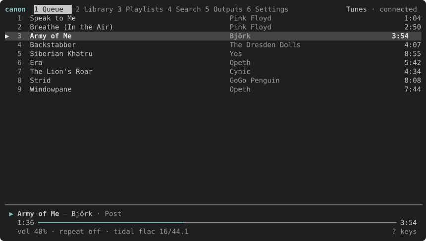
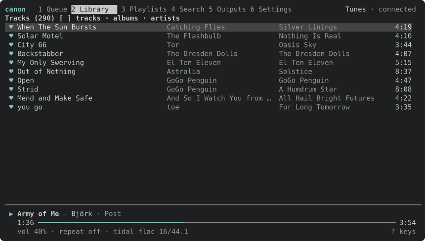
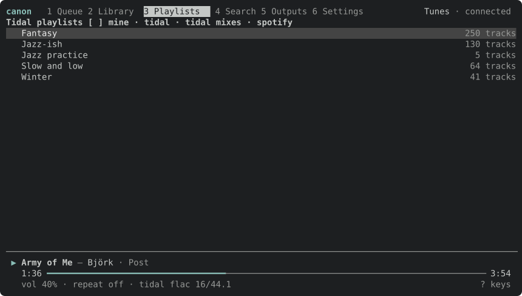
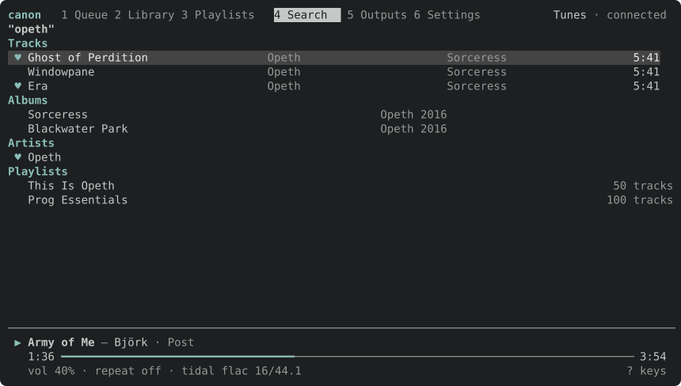
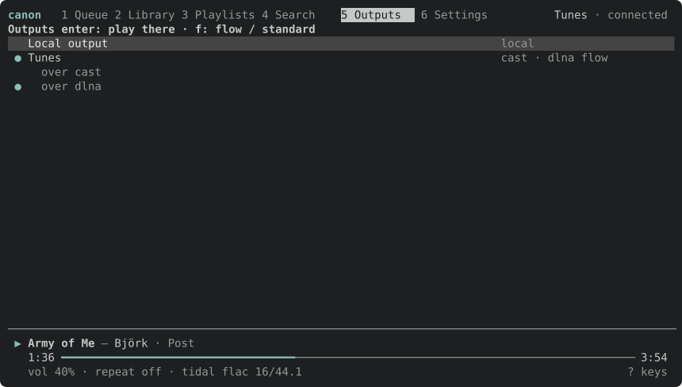
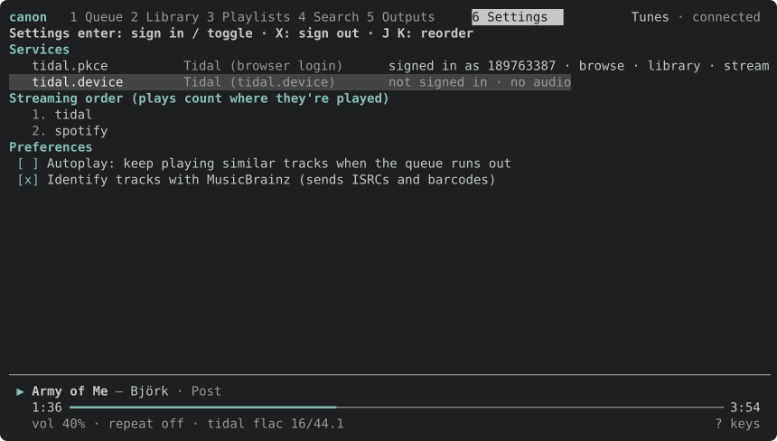
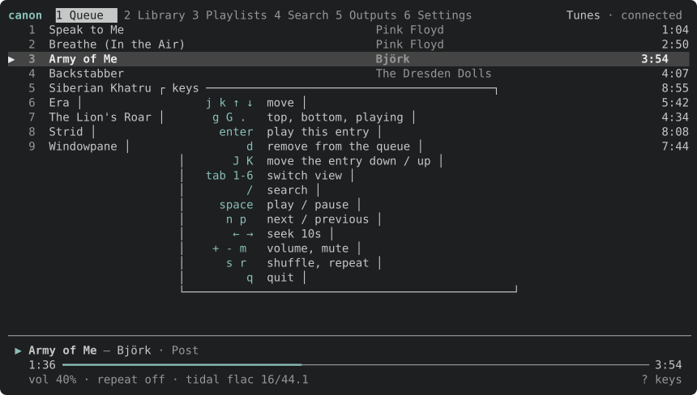

# The TUI

`canon tui` is canon's interactive client: a terminal UI over a running daemon's control plane.
It shows what's playing and the queue, browses the library, playlists and search, and chooses
outputs, signs in to services and changes settings. Everything it does goes through the same
WebSocket API any other client uses, so it can sit on another machine from the daemon.

```sh
canon tui                           # the daemon on this machine (127.0.0.1:7345)
canon tui --connect nas.local:7345  # one elsewhere
```

The frames below are rendered from the real TUI by a test (see [Regenerating the
frames](#regenerating-the-frames)).

## Layout

Six tabs across the top (`1`–`6`, or `tab` / `shift-tab`), what's playing along the bottom, and
the output and connection at the top right.

**Queue** — the queue, with ▶ on the entry playing. Under it: the track, its artists and album, a
progress bar that runs between the daemon's snapshots, the volume, repeat mode, and where the
audio comes from (`tidal flac 16/44.1`).



**Library** — what you've saved, as tracks, albums or artists (`[` `]` to switch). ♥ marks a
saved item; a greyed-out track has nothing bound that can stream. Large libraries load a page at
a time as you scroll.



**Playlists** — canon's own playlists, or a service's: `[` `]` cycles mine → Tidal playlists →
Tidal mixes → Spotify playlists. (Spotify has no mixes, so that pairing isn't offered.) A
service's playlists and mixes are read-only — canon never writes back to one — so they carry no
♥: `c` copies the list under the cursor into a new canon playlist, and `M` merges it into one you
already have.



**Search** — results in sections, playlists on the service among them. Albums, artists and
playlists open as pages of their own (`enter`), and `h` / `esc` goes back.



**Outputs** — every speaker canon has found, with the protocols it speaks and its mode. ● marks
where playback goes. A speaker that speaks both Cast and DLNA has a row for each, to pin one.



**Settings** — each way of connecting to each service and how it stands, the order services are
played from (plays count where they're played), and preferences.



## Keys

`?` shows the keys for the tab you're on.



**Everywhere**

| key | does |
| --- | --- |
| `tab` `1`–`6` | switch tab |
| `/` | search |
| `space` | play / pause |
| `n` `p` | next / previous |
| `←` `→` | seek 10 seconds |
| `+` `-` `m` | volume, mute |
| `s` `r` | shuffle, repeat (off → all → one) |
| `q` | quit |

**Queue**

| key | does |
| --- | --- |
| `j` `k` `↑` `↓` `g` `G` | move |
| `.` | jump to the playing entry |
| `enter` | play this entry |
| `d` | remove it |
| `J` `K` | move it down / up |

**Library, Playlists, Search**

| key | does |
| --- | --- |
| `enter` | on a track, play the list from there; on anything else, open it |
| `h` `esc` | back |
| `a` | add to the end of the queue |
| `A` | play next |
| `P` | play now |
| `*` | save / unsave |
| `c` | copy the list under the cursor into a new playlist |
| `M` | merge it into a playlist: canon's own are listed to pick from; `enter` takes one, `esc` gives up |
| `[` `]` | switch the listing: library tracks / albums / artists, playlists mine / Tidal / Tidal mixes / Spotify |

`c` and `M` act on the list the cursor is on — a playlist, a mix, an album — or, when the cursor
is on a track inside one, on the list being shown. Merging only appends what the target hasn't
got already, matched by recording, so re-merging an upstream playlist brings over just what's new
and never removes anything.

**Outputs, Settings**

| key | does |
| --- | --- |
| `enter` | play on this output; sign in; flip a preference |
| `f` | an output's mode: flow (gapless, one stream) or standard (one stream per track) |
| `J` `K` | move a service down / up the streaming order |
| `X` | sign out |

Signing in shows what to do: open a URL and paste back the address you land on, or open a link
and enter a code, which the TUI keeps checking until you approve it.

## Driving it from a script

`canon tui --headless` runs the same TUI with no terminal, driven by
[toque](https://github.com/rocketsurgery-games/toque)'s line protocol: one action per line on
stdin, and the frame it leads to, as text, on stdout.

```sh
printf 'key 2\nkey ]\nkey Enter\nkey a\nwait 2000\nquit\n' \
  | canon tui --headless --size 100x30 --connect 127.0.0.1:7345
```

Actions are `key <name>` (`Space`, `Enter`, `Esc`, `Left`, `C-c`, or a character), `type <text>`,
`wait <ms>`, `snapshot`, `resize <w> <h>` and `quit`. Each frame's header says what the TUI
believes (`tab=library depth=2 rows=10 cursor=0 pending=0`), and frames are drawn only once the
replies a key asked for are in, so a script never races the daemon. `--diff` prints only the lines
that changed.

## Regenerating the frames

```sh
cargo test -p canon-tui doc_frames -- --ignored
```

writes `docs/assets/tui-*.svg` from sample data. Run it when the TUI's look changes, and look at
the result: `qlmanage -t -s 1400 -o /tmp docs/assets/tui-queue.svg` makes a PNG on macOS.
